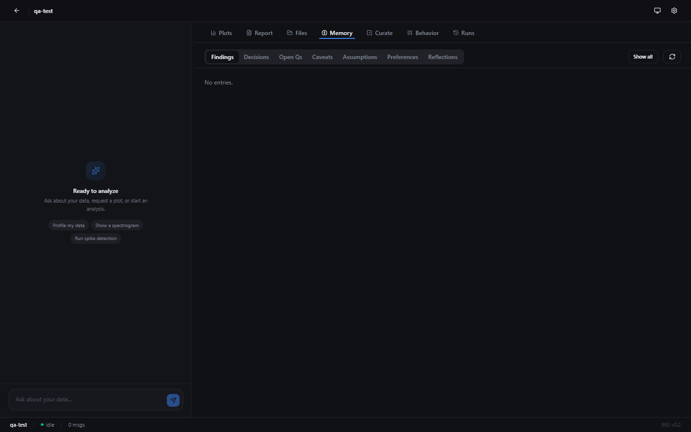

# IRIS — Intelligent Research & Insight System

> A local AI research partner that learns from your analyses *and* the published literature — so it suggests, questions, and contributes insights instead of just running what you ask.

[](LICENSE)
[](https://www.python.org/downloads/)
[](https://github.com/astral-sh/ruff)

---

## Status

**V2 memory system complete (2026-04).** The engine, DSL, 17 ops, and webapp shell are stable. The memory layer rewrite per [`IRIS Memory Restructure.md`](IRIS%20Memory%20Restructure.md) is shipped through **Phase 17**: SQLite-backed memory entries with propose→commit flow, FTS5 retrieval with triple-weighted rerank, optional sqlite-vec hybrid fusion, session-end + per-turn extraction, reflection cycles, progressive summarization, generated-op validation sandbox, LLM-driven contradiction detection, type-specific temporal decay, and retrieval-to-usage metrics. SpikeLab port (Phases 18–23) is **deferred**. Tracker: [`REVAMP.md`](REVAMP.md). Release tag: `v2.0-memory`.

---

## What it is

**IRIS** is both the app *and* the assistant inside it. The app is a local data analysis webapp; IRIS (the assistant, powered by Claude under the hood) is your research partner — not a code autocomplete. Every project accumulates its own memory — findings, decisions, caveats — and is cross-referenced against relevant published research.

| | |
|---|---|
| 🧠 **Learns from your work** | Per-project memory of runs, findings, and decisions |
| 📚 **Learns from the field** | Grounded in literature relevant to your data |
| ⚙️ **Actually runs the analysis** | Typed DSL + signal-processing engine on your real files |
| 🔁 **Reproducible** | Every plot carries its DSL, params, and input fingerprints |
| 🔒 **Local-first** | Your data never leaves your machine |

**Domain-agnostic by design.** IRIS works for any field — neuroscience, finance, climate, genomics, whatever you're analysing. *This repo* ships with a neuroscience focus (MEA recordings, calcium imaging).

## What makes it different

Most AI tools describe analyses and forget the conversation. IRIS is the opposite:

**Remembers your project:**

> **You:** "Plot the firing rate over time for channel 861."
>
> **IRIS:** *[runs `mea_trace(861).butter_bandpass.sliding_rms`, renders the plot]*<br>
> "Firing rate peaks around 12 min — matches the bursting pattern you flagged on 2026-03-14 in channel 742. Want me to align these with the calcium trace like last time?"

**Grounds suggestions in the literature:**

> **You:** "The ISI distribution on this culture looks bimodal — not sure what to make of it."
>
> **IRIS:** *[pulls up Wagenaar et al. 2006, *J. Neurosci.*]*<br>
> "Bimodal ISIs in cortical cultures are usually a signature of superbursts — short intra-burst intervals plus long inter-burst gaps. Wagenaar's group characterised this exact pattern at DIV 14–21. If that's what you're seeing, a burst-detection pass with a 100 ms ISI threshold would separate the two modes cleanly. Want me to run it?"

It proposes next steps, flags contradictions with prior runs or published findings, and remembers what you care about.

## Who it's for

- 🔬 Researchers in **any field** who want an analysis partner that grows with the project
- 🧬 Neuroscientists using this repo specifically — MEA + calcium imaging pipelines ready to go
- 📊 Anyone tired of stateless chat windows that forget everything between sessions

---

## What you can do with IRIS

A tour of the workflows IRIS is built for. Dialogue examples are illustrative of the intended experience; features marked *(planned)* describe the target end-state, not what's shipped today.

### 1. Ad-hoc data exploration

Turn natural requests into executed pipelines without writing code.

> **You:** "Filter channel 861 with a Butterworth bandpass, 300–3000 Hz, and show me the spectrogram."
>
> **IRIS:** *[runs `mea_trace(861).butter_bandpass(300, 3000).spectrogram`, renders the plot]*<br>
> "Dominant power stays under 1.5 kHz with a clear burst at 08:42. Want me to zoom that window or overlay an RMS envelope?"

> **You:** "What's in this file?"
>
> **IRIS:** *[profiles the upload]*<br>
> "It's a 60-channel MEA recording, 20 kHz, 12 min long. I've saved the profile — want the per-channel activity summary?"

### 2. Neuroscience-specific workflows

MEA, calcium imaging, and cross-modal analysis out of the box.

> **You:** "Run spike detection on all active channels, then burst-detect with a 100 ms ISI threshold."
>
> **IRIS:** *[runs `rt_detect` → burst grouping]*<br>
> "Found 23 active channels, 412 bursts total. Channels 742 and 861 dominate — 68% of burst mass. Separating superbursts next?"

> **You:** "Align the spikes on channel 861 with the calcium ΔF/F for ROI 4."
>
> **IRIS:** *[runs `calcium_preprocess` + normalized cross-correlation]*<br>
> "Peak cross-correlation at +180 ms lag. That matches the jGCaMP8m rise time we saw last week — calcium trails the MUA as expected."

### 3. Cross-session continuity

IRIS remembers the project. You don't have to re-explain.

> **You:** "Like we did last time."
>
> **IRIS:** "Last session (2026-03-14) you ran `butter_bandpass(300, 3000).sliding_rms(10ms)` on channels 742 and 861 and flagged the bursting around minute 12. Re-running that on today's recording — one sec."

> **You:** "Any concerns before I share these plots?"
>
> **IRIS:** "The day-3 sample rate is flagged in your caveats as suspect — the plot on slide 2 uses that recording. Worth double-checking before it goes out."

### 4. Literature-grounded interpretation *(planned)*

Unusual results get context from published work, with citations.

> **You:** "The ISI distribution on this culture looks bimodal — not sure what to make of it."
>
> **IRIS:** *[pulls up Wagenaar et al. 2006, *J. Neurosci.*]*<br>
> "Bimodal ISIs in cortical cultures are usually a signature of superbursts — short intra-burst intervals plus long inter-burst gaps. Wagenaar's group characterised this exact pattern at DIV 14–21. If that's what you're seeing, a burst-detection pass with a 100 ms ISI threshold would separate the two modes cleanly. Want me to run it?"

> **You:** "Is sliding-RMS actually the right envelope for this signal?"
>
> **IRIS:** "For MUA envelopes, Quian Quiroga & Panzeri (2009) recommend a Hilbert envelope over sliding RMS for sub-millisecond precision, but RMS is fine at 10 ms resolution like yours. I'd stay with RMS here."

### 5. Reproducing old analysis

Every artifact carries its DSL, params, and input fingerprints. Re-runs are exact.

> **You:** "Re-run the Feb 14 pipeline on today's recording."
>
> **IRIS:** *[looks up run `r_8a3f` from 2026-02-14, re-executes with the new input]*<br>
> "Re-ran `mea_trace.notch_filter.butter_bandpass(300, 3000).sliding_rms(10ms)` on `recording_2026-04-14.h5`. Cache hit on the filter stage (unchanged params + file mtime logic). New plot saved."

> **You:** "Did anything change in this pipeline since March?"
>
> **IRIS:** "The `sliding_rms` window widened from 5 ms to 10 ms on 2026-03-22. Before that date, the envelope was sharper — factor that in if you're comparing."

### 6. Iterative refinement & pushback *(planned)*

IRIS questions choices, flags contradictions, and suggests better params — configurable per project.

> **You:** "Use a 50 Hz notch filter."
>
> **IRIS:** "Your recording is US-based, 60 Hz mains. A 50 Hz notch won't remove the line noise — want 60 Hz instead?"

> **You:** "Add 'channel 742 is the reference' to the findings."
>
> **IRIS:** "Flagging a conflict — on 2026-02-14 you set channel 861 as the reference pair anchor. Is this a replacement, or are both references now?"

### 7. Authoring custom ops *(planned)*

When built-ins aren't enough, ask IRIS to write one — versioned and scoped to the project.

> **You:** "I need an op that computes Hilbert envelope on a bank of traces."
>
> **IRIS:** *[drafts `hilbert_envelope`, shows the code + type signature, runs the test suite]*<br>
> "Added `hilbert_envelope` to this project's op registry (v1). It accepts `MeaBank` → `MeaBank`, tests pass. Try it?"

### 8. Non-neuroscience domains

The engine is domain-agnostic. Drop in any time-series or tabular data.

> **You:** *[uploads daily S&P 500 returns, 10 years]* "Show rolling 30-day volatility and flag the regime shifts."
>
> **IRIS:** *[profiles the data, runs rolling std + changepoint detection]*<br>
> "3 major volatility regimes: 2020-03 COVID spike, 2022-Q2 rate-hike grind, 2023-Q1 recovery. Memory note: this project is tagged 'finance' — I'll keep neuroscience-specific ops out of suggestions."

> **You:** *[uploads monthly temperature anomalies]* "Decompose into trend, seasonal, and residual."
>
> **IRIS:** *[runs STL decomposition]*<br>
> "Trend is +0.18 °C/decade, seasonal amplitude is stable, residual variance grows post-2015. Save the decomposition as a derivative?"

### 9. Report writing

A living Markdown report accumulates findings as the analysis progresses.

> **You:** "Add this finding to the report under 'bursting dynamics'."
>
> **IRIS:** *[appends: 'Channels 742 and 861 carry 68% of burst mass; bursting peaks around minute 12']*<br>
> "Added. The bursting-dynamics section now has 4 findings. Want me to auto-insert the spectrogram plot as a figure?"

> **You:** "Draft a summary paragraph for the intro from what we've found so far."
>
> **IRIS:** "Drafted 4 sentences from your findings and decisions — open the report viewer to edit inline."

---

## Features

### 🧠 Project-scoped learning

Every project is its own universe. IRIS keeps a dedicated memory store per project — so context from your MEA bursting analysis doesn't bleed into your climate-data project, and vice versa.

What gets remembered, automatically:

- **Data profiles** — shapes, sample rates, units, channel counts, inferred on upload
- **Findings & decisions** — "we're treating channels 742 and 861 as the reference pair"
- **Caveats & open questions** — "sampling rate on day 3 is suspect, revisit later"
- **Preferences** — plot styles, default params, conventions you've set
- **Run lineage** — every pipeline execution, with inputs, params, and outputs

Switch projects and the workspace flips entirely — different data, different memory, different configured behaviors.

<!-- TODO: screenshot of the memory/curation panel showing memory entries -->
<p align="center">
  
</p>

### ⚙️ Configurable behavior *(planned)*

IRIS isn't a fixed personality. Every project has a `config.toml` plus a **Behavior** panel in the UI where you dial in *how* the assistant collaborates with you:

- **Autonomy level** — from "ask before every run" to "just figure it out"
- **Pushback strength** — how hard IRIS questions assumptions or flags issues
- **Suggestion frequency** — chatty partner vs. quiet executor
- **Literature grounding** — whether to cite papers proactively, only on request, or off
- **Tone & verbosity** — terse bullets vs. full paragraphs

<!-- TODO: screenshot of the Behavior panel -->
<p align="center">
  
</p>

### 🧪 Reproducible by construction

Every plot, dataset derivative, and report carries the DSL chain, parameters, and input fingerprints that produced it. Re-running six months later reproduces the exact output — or tells you loudly what changed.

### 📚 Literature-aware suggestions *(planned)*

IRIS pulls context from relevant published work and uses it to interpret unusual results, propose methods, and flag contradictions with prior findings — with citations so you can trace every claim.

### 🔌 Extensible ops

17 built-in signal-processing operations out of the box (filtering, detection, spectral, cross-modal). A project-scoped custom-op authoring flow — write, version, and wire a new op through chat — is *planned* for Phase 8 of the rewrite.

---

## How IRIS manages memory

IRIS's value comes from remembering, so memory isn't a side feature — it's the core. The design below describes the target end-state from [`IRIS Memory Restructure.md`](IRIS%20Memory%20Restructure.md). The storage substrates (SQLite + files + Markdown) and propose/commit curation are shipped; the intelligence layer (semantic search, reranking, reflection, continuous extraction, semantic dedup) is *planned* for later phases of the rewrite.

### Three substrates, one truth

| Substrate | Where it lives | What it's for |
|---|---|---|
| 📒 **SQLite database** | `iris.sqlite` inside the project | Source of truth — every event, message, run, artifact, and memory entry |
| 📁 **Content-addressed files** | `artifacts/` and `datasets/` | Raw bytes keyed by hash, so any output can be reproduced byte-for-byte |
| 📝 **Curated Markdown** | `memory/*.md` | Human-readable view, regenerated from SQLite so you can read, diff, and edit it in your editor |

Splitting the job keeps each format honest: SQLite is queryable, files are reproducible, Markdown is readable.

### What IRIS remembers

Typed memory entries the assistant accumulates as you work:

- **Findings** — "channel 861 shows burst-like firing after minute 8"
- **Decisions** — "we're treating channels 742 and 861 as the reference pair"
- **Caveats** — "day-3 sample rate looks off, don't trust it blindly"
- **Open questions** — "is the bimodal ISI a superburst signature?"
- **Preferences** — "user wants narrow-band spectrograms, no titles"

Every run, message, and artifact is logged to the event stream alongside these entries, so the full project history is replayable.

### Propose, don't hoard

Nothing lands in long-term memory silently:

1. IRIS **extracts** candidate entries continuously as you work and at session close.
2. You **review and commit** the ones worth keeping in the Curate panel — the rest are discarded.
3. Near-duplicates are **merged automatically** by semantic similarity, so the store doesn't bloat with restatements.

Long-term memory reflects what you actually endorsed — not the full transcript of everything ever said.

### Smart recall

Retrieval is hybrid, so the right memories surface whether you ask by keyword or by meaning:

- **Lexical search** (FTS5 BM25) — exact terms, channel IDs, op names
- **Semantic search** (vector embeddings) — conceptually related findings even when the wording differs
- **Reranking** — combines relevance, recency, and importance so stale or low-signal entries don't drown out the useful ones
- **Retrieval gating** — only pulls memory into context when the turn actually needs it, keeping the prompt lean

### Stays clean over time

- **Tool-result clearing** — bulky tool outputs (tables, raw logs, plots) are dropped from context while the *record* of the call stays in SQLite, so old calls don't bloat the prompt.
- **Reflection cycles** — IRIS periodically reviews recent memory, flags contradictions with prior findings, and surfaces them for resolution.
- **Per-project scoping** — switching projects switches context entirely; no cross-project leakage.
- **Local and inspectable** — everything is a file on your machine. Back it up, read it, delete it. No hidden vendor state.

Deeper dive: [`IRIS Memory Restructure.md`](IRIS%20Memory%20Restructure.md) (full design spec).

---

## Quickstart

### Prerequisites

- [Node.js](https://nodejs.org/) 20+
- [uv](https://github.com/astral-sh/uv) (`pip install uv`)
- A [Claude Max](https://claude.ai) subscription (the webapp uses the Claude Code SDK)

### Install

```bash
git clone https://github.com/philliplavrador/IRIS
cd IRIS

# Python backend
uv sync --all-extras

# Webapp
cd iris-app && npm install && cd ..
```

### Run

```bash
iris start
```

Launches the Python daemon (`:4002`), Express server (`:4001`), and Vite dev server (`:4173`), then opens [http://localhost:4173](http://localhost:4173). Create a project, drag in a dataset, and start chatting.

---

## How it works

```
                  ┌──────────────────┐
  you  ─chat─▶    │  React webapp    │ ──▶ plots, reports, files
                  │  (Vite, :4173)   │
                  └────────┬─────────┘
                           │ WebSocket
                  ┌────────▼─────────┐
                  │  Express server  │ ──▶ Claude Code SDK (agent)
                  │     (:4001)      │
                  └────────┬─────────┘
                           │ HTTP
                  ┌────────▼─────────┐          ┌──────────────────┐
                  │  FastAPI daemon  │ ◀──────▶ │ Project workspace │
                  │     (:4002)      │          │  data • memory •  │
                  │   ops • cache    │          │  conversations    │
                  └──────────────────┘          └──────────────────┘
```

The Express server gives the agent filesystem access, project context, and a handle to the Python engine. The daemon profiles uploaded data and executes DSL pipelines with a two-tier cache. The project workspace on disk is the ground truth — data, memory, conversations, plots, and reports all live there.

Deeper dive: [`docs/architecture.md`](docs/architecture.md).

---

## Architecture

```
iris-app/            React 19 + Express webapp
  server/              Express + Claude Code SDK bridge + WebSocket
  src/renderer/        Vite + Tailwind 4 + Zustand + Radix UI

src/iris/            Python package
  engine/              DSL parser, AST executor, op registry, two-tier cache
    ops/               17 operations (filtering, detection, spectral, …)
  daemon/              FastAPI backend (:4002) — ops, profiles, memory HTTP
    routes/            config, memory, ops, pipeline, projects, sessions
  projects/            Project workspaces + memory layer (SQLite + markdown)
  cli.py               `iris` CLI

configs/             Single config.toml (replaces legacy YAML quartet)
projects/            Per-project workspaces (gitignored except TEMPLATE)
tests/               Pytest suite (synthetic data, headless)
docs/                Architecture, operations math, project contract
```

---

## CLI

The `iris` CLI works for direct use outside the webapp:

```bash
iris config show
iris ops list
iris project new my-analysis --open
iris run "mea_trace(861).butter_bandpass.spectrogram"
```

---

## Documentation

| Document | What it covers |
|---|---|
| [`REVAMP.md`](REVAMP.md) | Ordered task ledger for the in-progress memory-system rewrite |
| [`IRIS Memory Restructure.md`](IRIS%20Memory%20Restructure.md) | Design spec for the new memory layer |
| [`docs/architecture.md`](docs/architecture.md) | DSL, AST, executor, cache, type system, bank vectorization |
| [`docs/operations.md`](docs/operations.md) | Math reference for all 17 ops |
| [`docs/projects.md`](docs/projects.md) | Project workspace contract |
| [`docs/data-format.md`](docs/data-format.md) | Expected MEA `.h5`, calcium `.npz`, and RT-Sort model layouts |
| [`docs/sessions.md`](docs/sessions.md) | Session directory layout + sidecar JSON schema |
| [`docs/development.md`](docs/development.md) | Contributor setup, running tests, project conventions |

---

## For contributors / agents

Before committing any change, run the validation gate:

```bash
bash scripts/check.sh       # POSIX
pwsh scripts/check.ps1      # Windows PowerShell
```

The gate runs `ruff format --check`, `ruff check`, `pyright`, `pytest`, `semgrep --config=auto --error`, and `vulture` across `src/iris` + `tests`, plus `tsc --noEmit` (and `npm run lint` when present) in `iris-app/`. Any non-zero exit blocks the commit.

---

## Acknowledgements

IRIS is developed in the [Kosik Lab](https://kosik.mcdb.ucsb.edu/) at UC Santa Barbara under the mentorship of Dr. Tjitse van der Molen, with computational guidance from Dr. Daniel Wagenaar's lab at Caltech. Pilot recordings used a Maxwell Biosystems MaxOne high-density MEA at 20 kHz paired with widefield calcium imaging at 50 Hz of mouse cortical primary cultures expressing jGCaMP8m. The RT-Sort spike sorting model used by the `rt_detect` op is from [van der Molen et al. (2024)](https://doi.org/10.1371/journal.pone.0312438).

## License

[BSD 3-Clause](LICENSE) © 2026 Phillip Lavrador, Kosik Lab UCSB.
